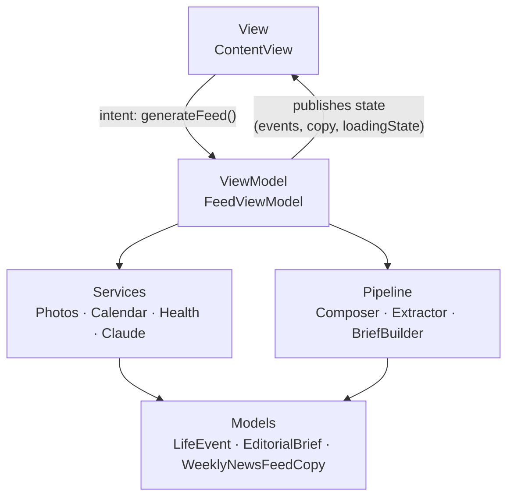
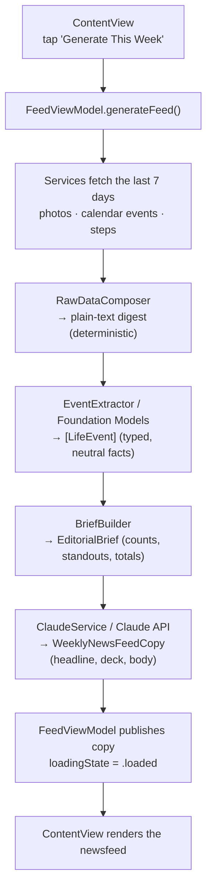

# Scoop — Architecture

Scoop automatically turns a person's **Photos, Calendar, and Health** data into a
weekly, newspaper‑style **newsfeed** about their own life — no journaling required.

This document explains how the app is put together: the **MVVM** layering, the
**data flow** from raw device data to rendered copy, and — most importantly — the
**two‑model AI boundary** that decides which AI does what.

---

## 1. Design principles

1. **MVVM with a real ViewModel.** The View renders state and sends intent; the
   `FeedViewModel` owns all orchestration and state; Services and the Pipeline do
   the work. No business logic lives in the View.
2. **Dependency injection everywhere.** Every collaborator is injected into the
   ViewModel via `init` (with defaults), so the app can swap real implementations
   for mocks on the Simulator or in tests without touching the View.
3. **The AI boundary is strict (see §4).** Deterministic Swift owns every number.
   On‑device Foundation Models only *understands* raw data into typed facts.
   Claude only *writes* prose. None of the three ever does another's job.

---

## 2. Project structure

```
Scoop/
├── App/          ScoopApp.swift            — entry point
├── Models/       LifeEvent.swift           — extracted facts (@Generable)
│                 EditorialBrief.swift      — the contract handed to Claude (Codable DTO)
│                 WeeklyNewsFeedCopy.swift  — the prose Claude returns (Codable)
├── Services/     PhotoService.swift        — Photos access → PhotoMetadata
│                 CalendarService.swift     — EventKit access → CalendarEvent
│                 HealthKitService.swift    — HealthKit access → step totals
│                 ClaudeService.swift       — Claude API call (URLSession) + mock
├── Pipeline/     RawDataComposer.swift     — deterministic digest of raw data
│                 EventExtractor.swift      — Foundation Models extraction + mock
│                 BriefBuilder.swift        — deterministic brief (counts, standouts)
├── ViewModels/   FeedViewModel.swift       — orchestration + published state
└── Views/        ContentView.swift         — renders state, sends intent
```

The folder tree *is* the architecture: Models are dumb data, Services do access,
Pipeline holds the AI boundary, the ViewModel orchestrates, the View renders.

---

## 3. MVVM layers

| Layer | Type(s) | Responsibility |
|---|---|---|
| **View** | `ContentView` | Renders `FeedViewModel` state; the only thing it *does* is call `viewModel.generateFeed()`. Holds one `@State private var viewModel`. |
| **ViewModel** | `FeedViewModel` (`@MainActor @Observable`) | Owns the injected collaborators and the published state (`events`, `copy`, `loadingState`). Runs the whole pipeline in `generateFeed()`. |
| **Model** | `LifeEvent`, `EditorialBrief`, `WeeklyNewsFeedCopy`, plus the per‑service structs | Pure data. No logic. |
| **Services** | `PhotoService`, `CalendarService`, `HealthKitService`, `ClaudeService` | Data access — Apple frameworks and the Claude network call. Each maps external data into app‑owned types. |
| **Pipeline** | `RawDataComposer`, `EventExtractor`, `BriefBuilder` | The transform seam: deterministic digest → AI extraction → deterministic brief. |

### MVVM at a glance



**Plain‑text version:**

```
ContentView  --(generateFeed)-->  FeedViewModel  -->  Services + Pipeline  -->  Models
     ^                                   |
     +------ publishes state ------------+
```

---

## 4. The two‑model AI boundary  ⭐

This is the most important idea in the app. There are **three** distinct workers,
and keeping them separate is what makes the architecture defensible.

| Worker | Where it runs | Its ONE job | Never does |
|---|---|---|---|
| **Deterministic Swift** | On device (plain code) | All logic and **numbers** — counts, totals, ranking standouts, date windows | Never writes prose |
| **Foundation Models** | On device (Apple Intelligence) | **Understand** messy raw data → typed, neutral `[LifeEvent]` facts | Never invents numbers or editorial voice |
| **Claude API** | Cloud (Anthropic) | **Write** the deadpan newsfeed prose from the brief | Never sees raw data; never computes or changes numbers |

Why this split is defensible:

- **Privacy** — raw Photos/Health/Calendar data never leaves the device; Foundation
  Models runs locally. Only a neutral, scrubbed `EditorialBrief` crosses the network.
- **Correctness** — every number is computed by testable Swift, not sampled from an
  LLM that can hallucinate.
- **Cost** — extraction happens for free on‑device instead of spending Claude tokens.
- **Separation of concerns** — each tool does the one thing it is best at.

The boundary is *enforced*, not just documented: `ClaudeService`'s system prompt
instructs Claude to write only from the brief and to **never invent or recompute
numbers** — the numbers are already correct because Swift fixed them.

### Who owns what

```mermaid
flowchart LR
    RAW["Raw device data<br/>Photos · Calendar · Health"]:::data
    SWIFT1["Deterministic Swift<br/>RawDataComposer"]:::swift
    FM["Foundation Models<br/>(on‑device)<br/>EventExtractor"]:::fm
    SWIFT2["Deterministic Swift<br/>BriefBuilder — owns the numbers"]:::swift
    CLAUDE["Claude API<br/>(cloud)<br/>ClaudeService — owns the prose"]:::claude
    UI["ContentView"]:::data

    RAW --> SWIFT1 --> FM -->|"[LifeEvent]"| SWIFT2 -->|"EditorialBrief"| CLAUDE -->|"WeeklyNewsFeedCopy"| UI

    classDef data fill:#f5f5f5,stroke:#616161,color:#000;
    classDef swift fill:#e8f5e9,stroke:#2e7d32,color:#000;
    classDef fm fill:#e3f2fd,stroke:#1565c0,color:#000;
    classDef claude fill:#fff3e0,stroke:#e65100,color:#000;
```



Green = deterministic Swift (owns numbers) · Blue = on‑device Foundation Models
(understands) · Orange = Claude (writes).

---

## 5. End‑to‑end data flow

Every step below happens inside `FeedViewModel.generateFeed()`.



**Plain‑text version:**

```
Services (Photos/Calendar/Health)
   → RawDataComposer        (deterministic Swift — a clean digest)
   → EventExtractor         (Foundation Models — [LifeEvent])
   → BriefBuilder           (deterministic Swift — EditorialBrief: counts, standouts)
   → ClaudeService          (Claude API — WeeklyNewsFeedCopy: prose)
   → FeedViewModel state    (copy, loadingState)
   → ContentView            (renders)
```

### The three data models along the way

| Model | Produced by | Shape | Purpose |
|---|---|---|---|
| `LifeEvent` | Foundation Models | title, summary, category, significance | Neutral, structured facts extracted from raw data |
| `EditorialBrief` | `BriefBuilder` | week range, totals, category counts, top‑N standouts | The **contract** handed to Claude — a `Codable` DTO deliberately decoupled from `LifeEvent` |
| `WeeklyNewsFeedCopy` | Claude | headline, subheadline, body | The finished editorial prose the View renders |

---

## 6. Dependency injection & testability

`FeedViewModel` injects every collaborator with a default, and injects the two AI
seams **behind protocols** (`EventExtracting`, `ClaudeGenerating`):

```swift
init(
    photosService: PhotoService = PhotoService(),
    calendarService: CalendarService = CalendarService(),
    healthKitService: HealthKitService = HealthKitService(),
    composer: RawDataComposer = RawDataComposer(),
    extractor: EventExtracting = MockEventExtractor(),   // protocol
    briefBuilder: BriefBuilder = BriefBuilder(),
    claude: ClaudeGenerating = MockClaudeService()       // protocol
)
```

- **Simulator / tests** use `MockEventExtractor` and `MockClaudeService` — no
  Apple Intelligence device, no API key, no network required.
- **Device** injects the real `OnDeviceEventExtractor` and `ClaudeService()`.

The View never knows which implementation is in use — that decision lives entirely
in the ViewModel, which is the whole point of the protocol seams.

---

## 7. API key handling (current status)

The Anthropic key lives in a **git‑ignored `Secrets.swift`** and the app calls the
Claude API directly. This is a **deliberate dev‑only shortcut** to get the pipeline
working end‑to‑end.

> ⚠️ **Known limitation:** an API key embedded in a mobile binary is extractable.
> The **production path** is a thin backend proxy (e.g. a serverless function) that
> holds the key and forwards requests to Claude; the app would then call the proxy,
> not Anthropic directly.

---

## 8. Status

- ✅ Services → Composer → Foundation Models → `[LifeEvent]`
- ✅ `BriefBuilder` → `EditorialBrief`
- ✅ `ClaudeService` → `WeeklyNewsFeedCopy` (behind a protocol, with a mock)
- ✅ Full pipeline wired through `FeedViewModel`
- ⬜ `WeeklyNewspaperView` — render the copy in a newspaper layout
- ⬜ Background refresh + SwiftData persistence (deferred until the synchronous pipeline is solid)
